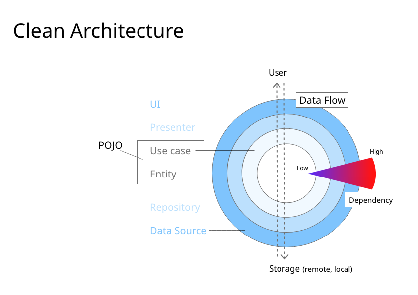

# Android Boilerplate

본 레포는 **클린 아키텍쳐부터 보일러플레이트까지🍭** 스터디의 일환으로 작성되었습니다. 

프로젝트에 도입하기 어려웠던 클린 아키텍쳐에 대한 개념들, 해당 아키텍쳐 구현에 필요한 여러 패턴에 대해 다룰 예정입니다. 누구나 손쉽게 이해할 수 있는 명료한 아키텍쳐 및 패키징을 구현하는게 목표입니다.

## 아키텍쳐란?
아키텍쳐는 무엇이길래, 항상 프로그래머들 사이에서 회자되며 우리는 프로젝트에 이를 도입하길 원하는 걸까요.

[Software Architecture by Carnegie Mellon](https://resources.sei.cmu.edu/asset_files/FactSheet/2010_010_001_513810.pdf)

카네기 멜론 대학의 What is your definition of software architecture?에서는 다양한 정의로 소프트웨어 아키텍쳐를 설명하고 있습니다. 이렇게 수많은 관점에서 이야기할 수 있는 소프트웨어 아키텍쳐라는 것을 본 문서에서는 다음과 같이 정의하려고 합니다.

> 비지니스 요구 사항을 만족하는 시스템을 구축하기 위해서 전체 시스템에 대한 구조를 정의한 문서

본 정의에서 가장 중요한 포인트는 비지니스 요구 사항입니다. 비지니스 요구 사항은 사용자가 프로덕트에 기대하는 바로 바꿔말할 수 있으며, 즉 사용자가 생각하는대로 동작하는 소프트웨어 및 프로덕트를 구축하는 것을 의미합니다.

따라서 저는 소프트웨어 아키텍쳐의 정의를 다음과 같이 재해석할 수 있다고 생각합니다.
> 사용자가 프로덕트에 기대하는 동작 등, 인간의 인지적인 부분을 소프트웨어로 구현하기 위한 구조

## 왜 아키텍쳐 도입해야하는가.

## Clean Architecture

위 사진은 Uncle Bob이 제안한 The Clean Architecture입니다. 대부분의 프로그래머들이 위의 그림을 한번쯤은 본 적 있으리라 생각합니다. 저는 해당 그림을 처음에 맞닥뜨렸을 때, 어떠한 내용인지 한 눈에 들어오지 않아 이해를 하는데 꽤나 많은 시간을 투자했습니다. 원 안에 적혀있는 내용들은 제쳐둔 채로 다음과 같이 원을 해석하는 것이 빠른 이해를 돕습니다.

ui기본적으로 Clean Architecture의 목적은 관심사의 분리(Separation of Concern)입니다. 소프트웨어의 계층을 구분하므로, 각 파트의 역할을 한정합니다. 예를 들면, View는 사용자에게 user interface를 제공하는 역할만 수행하야하는 것처럼 말이죠.

본 다이어그램은 총 4개의 파트로 구성되어있습니다. 

원의 외부부터 
- Framework & Driver
- Interface Adapter
- Application Business Rule
- Enterprise Business Rule

외부로 갈 수록 의존성이 높아지는 고수준의 소프트웨어 등이 존재하며, 원의 중심으로 들어갈 수록 의존성이 낮은 비즈니스 모델에 가까운 개념입니다.

이해를 돕기 위해 자주 사용되는 용어들로 치환해서 네 개의 개념을 구성하겠습니다.

- Application
- Presentation
- Use Case
- Entity

위의 구성보다는 보기 좀 편해진 느낌입니다. 사실 Uncle Bob이 Clean Architecture를 위와같이 정의할 수 없었던 이유는, 해당 아키텍쳐가 어느 특정한 분야에만 종속적인 것이 아닌 모든 소프트웨어에 통용되는 개념이기 때문입니다. 저희는 이를 안드로이드에 적용할 것이니 좀 더 축약해서 이해를 먼저 수반한 상태로 클린 아키텍쳐의 본질을 파악하도록 합시다.

### Entity
> 엔티티는 핵심 비지니스 규칙으로 가장 고수준의 규칙입니다. 비지니스 요구 사항이 바뀌지 않는 이상 바뀌지 않으며, 같은 비지니스 요구 사항이라면 어떠한 framework와 환경을 이용해 구현하던 같은 구현체입니다. 즉, 데이터만을 정의하는 POJO 모델이라고 할 수 있습니다.

### Use Case
> 본 계층에서는 엔티티를 포함하는 사용자의 동작(유즈케이스)를 구현합니다. 이 또한 엔티티와 동일하게 프레임워크에 종속되지 않아야합니다.

### Presentation
> 프레젠테이션 계층입니다. 사실 본 계층은 Interface Adapter라는 본래의 의미로 개념을 정리하는 것이 이해가 편합니다. 본 계층은 내부계층(Entity, Use Case)을 사용하려하는 어떠한 프레임워크 또는 그에 상응하는 수준의 소프트웨어와 내부 계층을 이어주는 Adapter입니다.

### Application
> 본 계층은 원의 중심과 가장 거리가 먼, 즉 low policy인 최상위 계층입니다. 내부 계층에 모든 종속성을 포함하고 있습니다.

본 다이어그램은 꼭 네 가지로 구성해야한다는 법은 없습니다. 하지만 원 내부일 수록 의존성이 낮고, 원 외부로 갈 수록 의존성이 높다는 것만은 어떠한 형태로 다이어그램을 구성해도 동일하도록 해야합니다.

이러한 것을 객체지향 설계 5원칙(SOLID) 중 [의존성 역전](https://ko.wikipedia.org/wiki/%EC%9D%98%EC%A1%B4%EA%B4%80%EA%B3%84_%EC%97%AD%EC%A0%84_%EC%9B%90%EC%B9%99)의 원칙이라고 합니다. 지금까지 설명해온 상위 정책(상대적 불변)은 하위 정책(상대적 가변)에 의존해서는 안된다는 것과 일맥상통하는 개념입니다.

## Layered Architecture

## Finally

## Member
- [강준후](https://github.com/stevejhkang)
- [채명준](https://github.com/myungjunChae)

본 스터디에 참여하고 싶으신 분들은 멤버를 통해 연락을 취해주세요.

## Reference
https://resources.sei.cmu.edu/library/asset-view.cfm?assetID=513807

## 추가적인 이해 필요
- Framework와 Interface Adapter의 의존관계